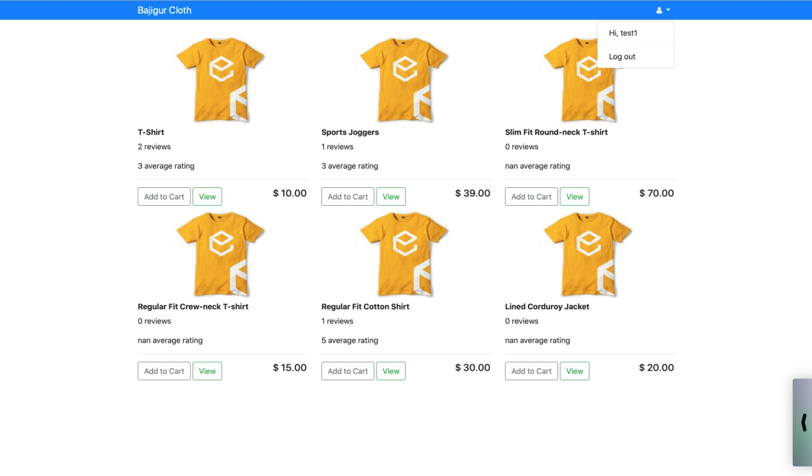
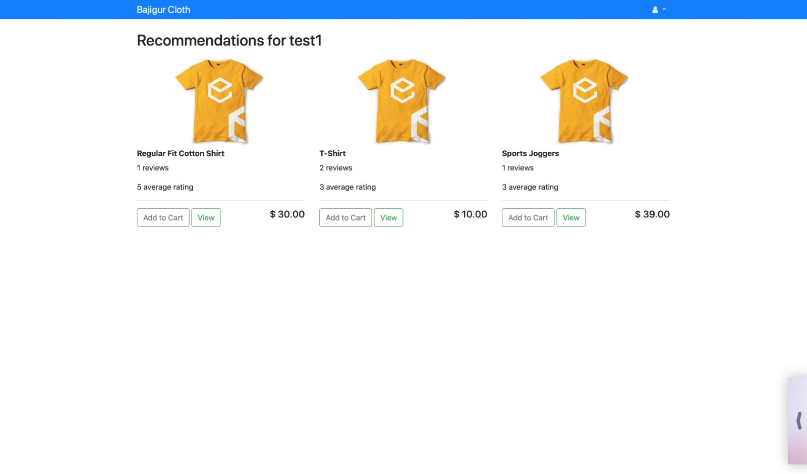
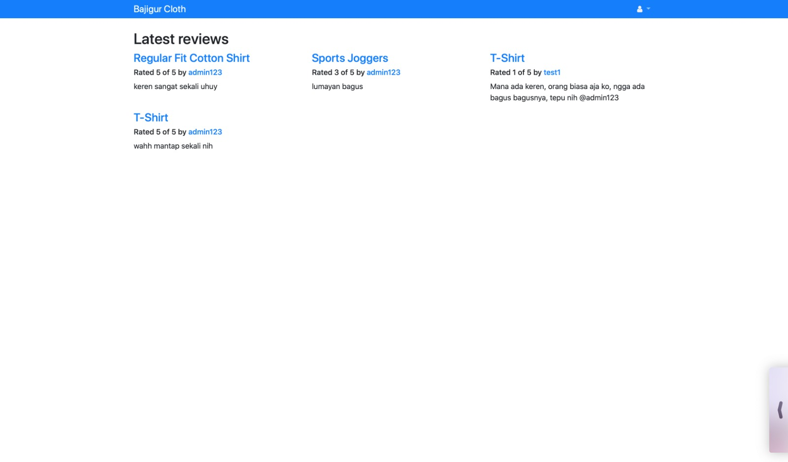
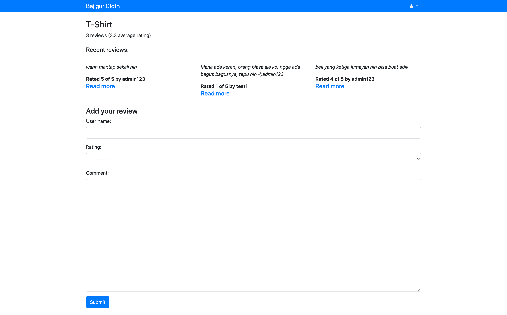

# bajigur-cloth

Rekomendasi produk menggunakan algoritma `Clustering User Data and K-Means Clustering`

## Teknologi python yang digunakan:
- Django
- Pandas
- SciPy
- Scikit-learn.

## Algoritma rekomendasi produk:
- `src/products/suggestions.py`
    ```python
    from django.contrib.auth.models import User
    from sklearn.cluster import KMeans
    from scipy.sparse import dok_matrix, csr_matrix
    import numpy as np

    from .models import Product, Review, Cluster


    # Clustering User Data and K-Means Clustering Algorithms
    def update_clusters():
        num_reviews = Review.objects.count()

        update_step = 6

        if num_reviews % update_step == 0:
            all_user_names = list(map(lambda x: x.username, User.objects.only('username')))
            all_product_ids = set(map(lambda x: x.product.id, Review.objects.only('product')))
            num_users = len(all_user_names)
            ratings_m = dok_matrix((num_users, max(all_product_ids) + 1), dtype=np.float32)
            for i in range(num_users):
                user_reviews = Review.objects.filter(user_name=all_user_names[i])
                for user_review in user_reviews:
                    ratings_m[i, user_review.product.id] = user_review.rating

                k = int(num_users / 10) + 2
                kmeans = KMeans(n_clusters=k)
                clustering = kmeans.fit(ratings_m.tocsr())

                Cluster.objects.all().delete()
                new_clusters = {i: Cluster(name=i) for i in range(k)}
                for cluster in new_clusters.values():
                    cluster.save()
                for i, cluster_label in enumerate(clustering.labels_):
                    new_clusters[cluster_label].users.add(User.objects.get(username=all_user_names[i]))

                print(new_clusters)

    ```
- `src/products/views.py`
  ```python
  @login_required
  def add_review(request, product_id):
      product = get_object_or_404(Product, pk=product_id)
      form = ReviewForm(request.POST)
      if form.is_valid():
          rating = form.cleaned_data['rating']
          comment = form.cleaned_data['comment']
          user_name = request.user.username
          review = Review()
          review.product = product
          review.user_name = user_name
          review.rating = rating
          review.comment = comment
          review.pub_date = datetime.datetime.now()
          review.save()
          update_clusters()
          print(update_clusters)

          return HttpResponseRedirect(reverse('product-detail', args=(product.id, )))
      return render(request, 'products/product_detail.html', {'product': product, 'form': form})

  @login_required
  def user_recommendation_list(request):
      user_reviews = Review.objects.filter(user_name=request.user.username).prefetch_related('product')

      try:
          user_cluster_name = \
              User.objects.get(username=request.user.username).cluster_set.first().name
      except Exception:
          update_clusters()
          time.sleep(1)
          user_cluster_name = \
              User.objects.get(username=request.user.username).cluster_set.first().name

      user_cluster_other_members = \
          Cluster.objects.get(name=user_cluster_name).users \
          .exclude(username=request.user.username).all()
      other_members_usernames = set(map(lambda x: x.username, user_cluster_other_members))

      other_users_reviews = \
          Review.objects.filter(user_name__in=other_members_usernames) \
          .exclude(product__id__in=user_reviews)

      other_users_reviews_product_ids = set(map(lambda x: x.product.id, other_users_reviews))

      product_list = sorted(
          list(Product.objects.filter(id__in=other_users_reviews_product_ids)),
          key=lambda x: x.average_rating(),
          reverse=True
      )

      return render(
          request,
          'products/user_recommendation_list.html',
          {'username': request.user.username, 'products': product_list}
      )
  ```

## Screenshot:
- `All product`
  
  

- `Recommendations product for user`
  
  
  
- `Latest reviews`
  
  

- `Recent review & add review some product`
  
  

## How to install & run:
```
git clone https://github.com/purwowd/bajigur-cloth.git
cd bajigur-cloth/src/
pip3 install -r requirements.txt
python3 manage.py runserver

- Buka browser dan akses alamat: `localhost:8000`
```

## Superuser:
```
username: admin123
password: admin123
```

## Account demo:
```
username: test1
password: makanayam
```
